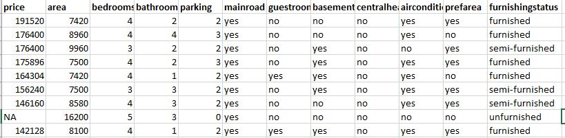
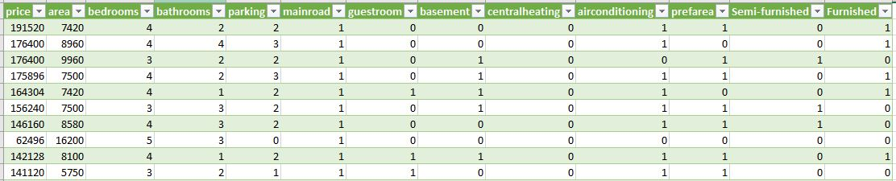
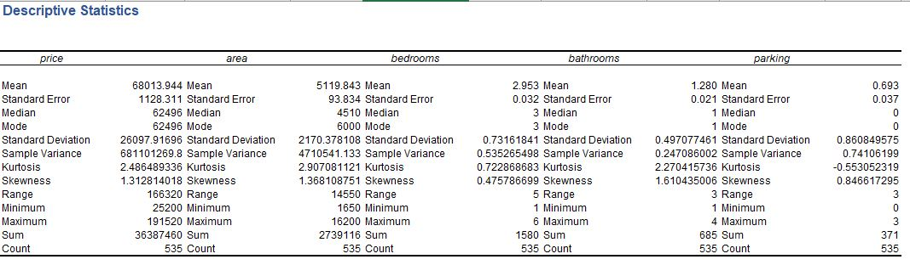
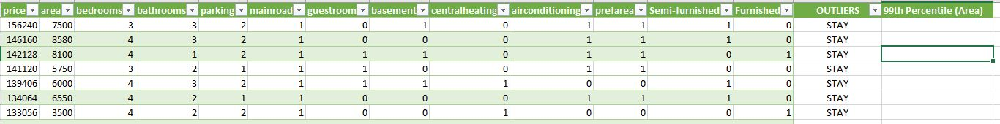
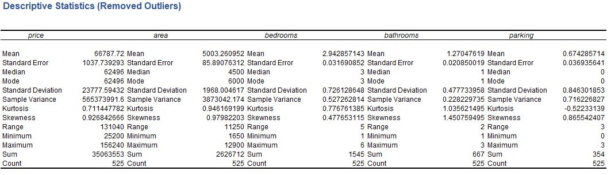

# House Price Prediction 

## Environment
I used Excel to perform Data Cleaning and Analysis using Linear Regression

## Data and Link
I used the dataset provided by datascience365.com. 

This data provide information about houses i.e. area, no. of bedrooms/bathrooms, furnished/semi-furnished, price, etc.

We want to build a regression model learning from this dataset to predict house price.

Here is the link to the excel file: https://drive.google.com/drive/folders/1yn0MCEoyZHdS9diTtCAyqYwqQlf4Zwqo

## 1. Data Cleaning

Starting from raw data, there are many NA/errors and categorical variables that we need to handle.

**1.1 Fill missing value in Price column using Median**

**1.2 Convert categorical variables to 1/0 flags.**

## 2. Descriptive Analysis

After the data is cleaned, I performed a descriptive analysis to see if our data is normally distributed and would be a good set to be used to train regression model

We can see that based on Skewness, Mean, Standard deviation, we need to remove some outliers from price and area.

Then I ran another descriptive analysis to see the result after removing outliers.

## 3. Building Linear Regression Model

**3.1 Split training set and test set (80/20)**

**3.2 to see the result please check at:**
