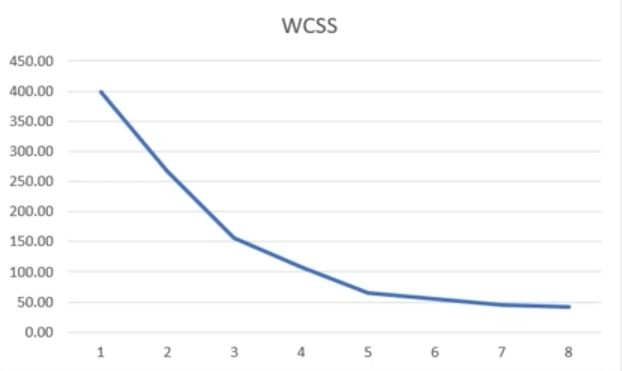
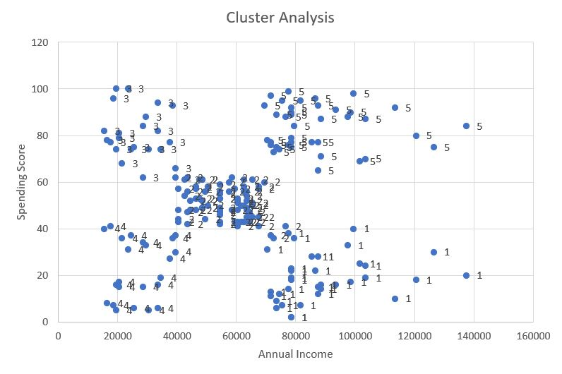

# Market Segmentation in Excel  

## Environment
I used Excel to perform K-mean Clustering on customers' spending score and annual income

## Data and Link
I used the dataset provided by datascience365.com

Here is the link to the excel file:

## Analysis and Result

I ran K-mean clustering on different k values to find the best WCSS.

in this case, I picked k=5.

K-mean Clustering using Xreal correctly classified 5 different groups.

Cluster 1: High annual income/low spending score -> This group of customers should be there primary target since they have the money to spend but yet they do not.

Cluster 2: Average annual income/average spending score -> Standard group

Cluster 3: Low annual income/high spending score -> Shopaholics

Cluster 4: Low income/low spending score -> Least likely to spend 

Cluster 5: High income/high spending score -> Loyal customers

Using clustering can differentiate prime targets and so we can invest in the right customer group.
Solution to our primary target:
1. Add new facilities and brands
2. Introduce loyalty programs (discount vouchers, cards, raffles)
